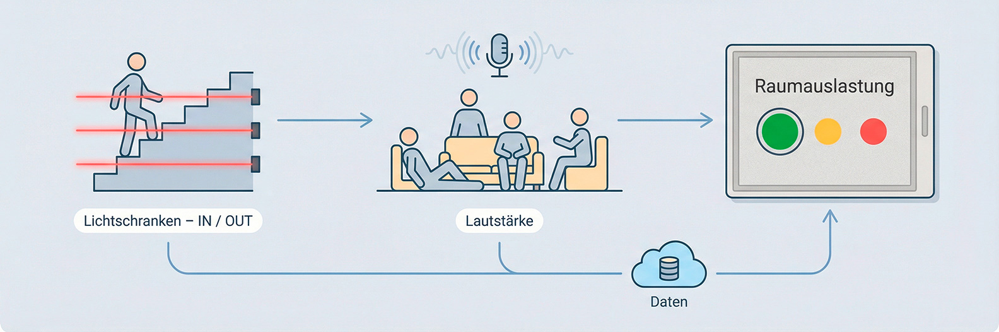

# 🏢 Raum-Tracker – Aufenthaltsraum IM5

> Wir machen sichtbar, wie belebt der Aufenthaltsraum IM5 gerade ist – in Echtzeit, anonym und auf einen Blick.

## Warum wir das bauen

- Studierende und Mitarbeitende sehen sofort, ob es sich lohnt, in den Aufenthaltsraum zu gehen oder besser im Foyer zu bleiben.
- Leitung und Betriebstechnik erhalten belastbare Daten zu Stoßzeiten, Lärmbelastung und Nutzungsmustern.
- Das Projekt zeigt exemplarisch, wie IoT-Sensorik, ein leichtgewichtiges Backend und eine physische Visualisierung zusammenspielen können.

## Ergebnis in Kürze

- **IoT-Sensorik** am Treppenaufgang zählt Bewegungsrichtungen ohne personenbezogene Daten zu erfassen.
- **Ein Mikrofon** erfasst die Geräuschkulisse und ergänzt die Auslastungsschätzung.
- **Ein PHP-/MySQL-Backend** harmonisiert alle Signale, speichert Historie und stellt eine JSON-API bereit.
- **Ein 4-Farben-E-Ink-Display** im Foyer visualisiert die aktuelle Situation im 3-Minuten-Takt.

## Systemaufbau auf einen Blick

## Hauptkomponenten

### 1. Lichtschranken-Gate
- Drei ToF-Sensoren (2× VL53L0X, 1× VL6180X) bilden eine Sequenzlogik und erkennen zuverlässig, ob jemand den Raum betritt oder verlässt.
- Der Gate-ESP32 bereinigt Fehlmessungen per Timeout, sendet jeden Flow an `POST /api/v1/gate/flow` und hält parallel den Live-Zähler (`update_count.php`) aktuell.

### 2. Raum-Mikrofon
- Ein INMP441-I2S-Mikrofon sammelt kontinuierlich Samples, bildet RMS-Werte und berechnet Dezibel.
- Der Audio-ESP32 funkt im Minutentakt an `POST /api/v1/sensor/reading` und liefert damit die zweite Achse der Auslastung.

### 3. Backend & Datenbank
- Vanilla-PHP mit PDO spricht eine MySQL-Datenbank (`db/database_einrichtung.sql` liefert das Schema).
- Cronjob `api/cron/generate_occupancy_snapshot.php` fasst alle 60 Sekunden Flows und Geräuschpegel zu einem Snapshot zusammen (People Estimate, Noise Level, Qualitätslevel).
- Die API stellt u. a. `GET /api/v1/occupancy/current`, `GET /api/v1/occupancy/history` und Statistik-Endpunkte bereit.

### 4. Visualisierung
- Ein Waveshare 2.36" 4-Farben-E-Ink zieht sich jede Minute den aktuellen Snapshot (`/api/v1/occupancy/current`) und zeigt drei Quadranten: Auslastung des Raumes mit ungefährer Personenanzahl, Lautstärke und die Zeit der Messung.
- Außerhalb des Betriebsfensters (10–14 Uhr) zeigt das Display klar, dass keine Live-Daten erhoben werden.

## Datenfluss – was passiert, wenn jemand den Raum betritt?

1. **Sensorik**: Eine Person löst die Sequenz A → Mitte → B aus. Der Gate-ESP32 erhöht den Zähler und sendet einen Flow-Event (Richtung, Zeitstempel, Signalqualität).
2. **Backend**: Der Flow landet sofort in der Tabelle `flow_event`. Die Cronroutine bündelt alle neuen Events und kombiniert sie mit dem letzten Lautstärkewert (Tabelle `sensor_reading`).
3. **Snapshot**: Daraus entsteht der neue Eintrag in `occupancy_snapshot` (People Estimate, Geräusch in dB, Level LOW/MEDIUM/HIGH, Confidence).
4. **Display & Web**: Display-ESP32 sowie Web-Dashboard (`index.html` / `frontend`) rufen `GET /api/v1/occupancy/current` bzw. `history` ab und aktualisieren Visualisierungen.

Die ausführliche Beschreibung der Sensorik inkl. Sequenzdiagrammen liegt in [`Dokumentation/Beschreibung_physische_Elemente.md`](Dokumentation/Beschreibung_physische_Elemente.md).

## Auslastungslogik in zwei Sätzen

- **Personenfluss**: Die Netto-Bilanz aus IN- und OUT-Events liefert eine robuste Schätzung der Personenanzahl. Eine Drift-Korrektur (siehe `api/includes/DriftCorrector.php`) verhindert, dass der Zähler langsam davonläuft.
- **Level-Bestimmung**: Lautstärke und Personenanzahl werden gewichtet, um LOW/MEDIUM/HIGH zu bestimmen – ruhig + wenig Personen ⇒ grün, laut + viele Personen ⇒ rot. Schwellen und Gewichtung sind in `generate_occupancy_snapshot.php` dokumentiert und leicht anpassbar.

## Projektstruktur

| Pfad | Inhalt |
| --- | --- |
| `arduino/` | Aktuelle und historische Firmware-Sketche für Gate, Mikrofon und Display. |
| `api/` | PHP-Backend inkl. Routing (`index.php`), Config, Auth und Cronjob. |
| `db/` | SQL-Skripte für Schema, Drift-Parameter und kompakte API-Doku. |
| `Dokumentation/` | Konzeptpapiere, Hardware-Beschreibungen, Bilder sowie Projektbeschreibung. |
| `frontend/` + `index.html` | Web-Dashboard (derzeit leichtgewichtig, dient als Referenz für API-Verbrauch). |
| `raspberry-pi/` | Setup-Skripte für die Brücke zwischen Campus-Netz und Sensorik. |
| `update_count.php` | Fallback-Endpunkt für ältere Gate-Firmware, die nur den Live-Zähler aktualisiert. |

## Tech Stack

- **Backend:** Vanilla-PHP 8.x, MySQL, PDO, Cronjobs
- **API:** RESTful JSON mit leichter Auth-Schicht (API-Keys + Cron-Token)
- **Hardware:** Drei ToF-Lichtschranken (VL53L0X & VL6180X), INMP441 I2S-Mikrofon, mehrere ESP32-C6-N8
- **Visualisierung:** Waveshare 2.36" E-Ink (4 Farben) plus Web-Dashboard (HTML/CSS/JS ohne Frameworks)
- **Netzwerk:** alle Controller verwenden das "MMP_MediaApp" WLAN.
- **Edge/Infra:** Raspberry Pi als Brücke zwischen Campus-Netz und Sensorik, hostet Cronjob für Snapshot-Generierung.

## Haupt-Features

- 🚶 **Personenfluss-Erkennung:** Sequenzlogik aus drei Sensoren bestimmt Richtungen und verhindert Fehlzählungen.
- 🔊 **Lautstärkeanalyse:** Mikrofon liefert dB-Werte als zweite Dimension der Auslastung.
- 📊 **Snapshots & Historie:** Backend erzeugt minütliche Occupancy-Snapshots, Statistik-Endpunkte zeigen Trends.
- 🖼️ **Physische Anzeige:** Das E-Ink Display zeigt drei Quadranten und reagiert auf Auslastungslevel in Echtzeit.
- 🛡️ **Datenschutz:** Keine Kamera, keine personenbezogenen Daten – nur Bewegungsmuster und Geräuschpegel.

## Weiterführende Unterlagen

- [`Dokumentation/Beschreibung_physische_Elemente.md`](Dokumentation/Beschreibung_physische_Elemente.md) – Sensorik, Datenfluss und Pinouts.
- [`Dokumentation/Beschreibung_Datenbank.md`](Dokumentation/Beschreibung_Datenbank.md) – Tabellen, Relationen und Beispielabfragen.
- [`Dokumentation/Beschreibung_Projekt_Raum_Tracker.md`](Dokumentation/Beschreibung_Projekt_Raum_Tracker.md) – Projektkontext, MVP und geplante Phasen.
- [`db/API_Endpoints_Kompakt.md`](db/API_Endpoints_Kompakt.md) – Kurzübersicht aller Endpunkte mit Beispielpayload.

## Projektdokumentation

Folgt in Kürze und wird alle projektrelevanten Unterlagen, Entscheidungsgrundlagen und Lessons Learned bündeln.

---

**Stand:** 10. Dezember 2025 · **Version:** 2.1 · **Kontakt:** IM5 Projektteam «Raum-Tracker»
